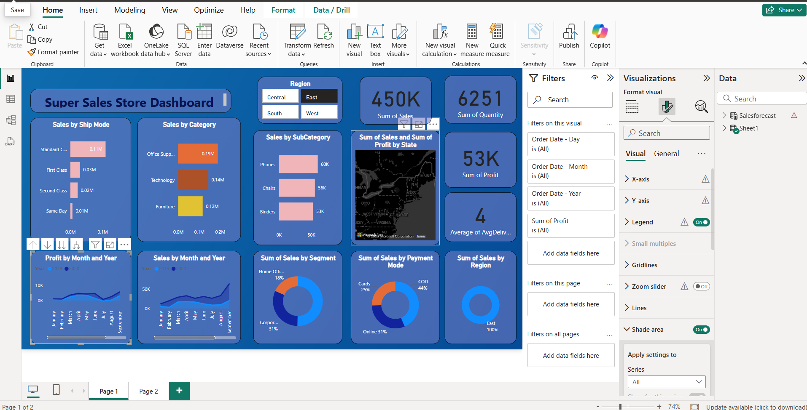
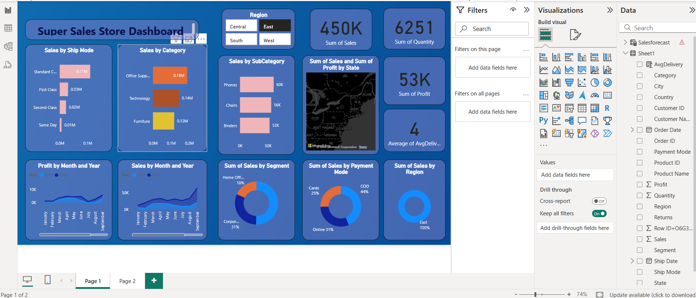

### Power BI Project – SuperStore Sales Dashboard

An interactive Power BI dashboard that visualizes SuperStore sales performance across various dimensions including region, product category, shipping mode, sales trends, and customer segments. This project aims to support strategic decision-making through clear insights derived from transactional data.

---

## 🧾 Project Objectives

- Analyze sales and profit by time, region, and product categories  
- Visualize delivery performance and customer segments  
- Identify trends, bottlenecks, and sales drivers  
- Provide an interactive reporting experience using filters and slicers  

---

## 🔧 Tools Used

- Microsoft Power BI Desktop  
- Excel (as data source)  
- Power Query for ETL  
- DAX for calculations  

---

## 📁 Files Included

| File Name                     | Description                                     |
|------------------------------|-------------------------------------------------|
| SuperStore Sales Dashboard.pbix | Power BI report file containing all visuals     |
| SuperStore Sales DataSet.xlsx   | Raw dataset used for the dashboard             |
| Screenshot 1.png             | Page 1 visual of the dashboard                  |
| Screenshot 2.png             | Page 2 visual of the dashboard                  |

---

## 📌 Key Features

- 📦 Sales by Ship Mode, Category, Subcategory  
- 📍 Profit & Sales by Region and State (Map)  
- 📈 Monthly Sales and Profit Trends (Line Charts)  
- 🧮 KPI Cards for total sales, profit, quantity, and delivery performance  
- 📊 Segment-wise and Payment Mode analysis  
- 🎛️ Slicers: Year, Region, Segment, Ship Mode, etc.  

---

## 🖼️ Dashboard Preview

### Page 1  

### Page 2  

---

## 🚀 How to Use

1. Download the Power BI report file and dataset  
2. Open the `.pbix` file in Power BI Desktop  
3. Load the dataset if prompted  
4. Navigate through the dashboard pages  
5. Use slicers to explore data by region, year, product, or payment mode  
6. Interpret the KPIs and graphs for actionable insights  

---

## 📈 Key Insights

- Most sales come from the East region, with strong performance in Office Supplies  
- Standard Class is the most used shipping mode  
- Sales and profit increased consistently over the months  
- Payment via Cash on Delivery (COD) leads in customer preference  
- Certain states contribute significantly to profit, seen in map view  

---

## 📄 License

This project is intended for educational and professional portfolio purposes only.
